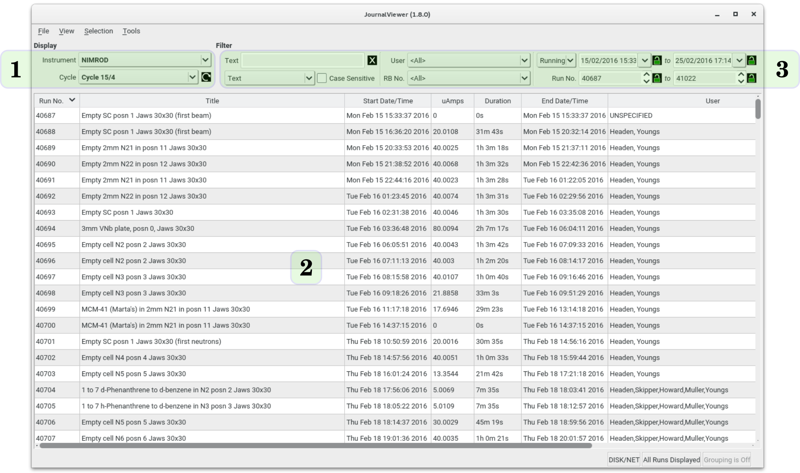

The main window displays the contents of the current instrument / journal target, and allows filtering of this data through controls located at the top of the main table (Figure 1). A single journal file or, optionally, the complete history of all available journal files available for a single instrument can be selected and viewed with the **Instrument** and **Cycle** controls (1).  If local data is also present then this is accessible via the Instrument list through the 'LOCAL' entry. In this case the **Cycle** control will display all individual groups of local data that are available.

{.imgfull}

## Main View

The main view (2) displays in tabular form the available run data in the current journal. Run data are, by default, listed in order of increasing run number, but the quantity by which visible data are sorted can be changed by clicking on the header for the relevant column.  The visible columns can be adjusted through the View menu. The visibility and ordering of columns in the main view also affects the format of the output from the [CLI interface](/jv/docs/cli).

## Filtering

The **Filter** group (3) at the top of the main window allows limits on the visible run data for the current instrument/journal selection to be tailored to suit - by default all runs from the current journal target(s) are shown. Run data may be filtered by any combination of:

+ Text, wildcard, or regular expression (Perl style) search of the run Title
+ Available User and RB No. data (extracted from the available runs)
+ Start / running time and date
+ Run number limits

For the main Title search the filtering is not performed until return or enter are pressed. A search string may also be typed directly into the User or RB selectors in order to perform a plaintext search of the relevant string.

Run number limits may be made persistent across refreshes of the journal data by enabling the padlock icon next to the relevant quantity.

## Grouping

Instead of sorting runs by one of the displayed quantities, runs possessing the same title may be listed together in continuous chunks by enabling grouping (**Tools&#8594;Enable Grouping**, or **Ctrl-G**). Selecting the option a second time will disable grouping and revert to the previous sort order. This feature facilitates simplified transfer of associated measurement data into data reduction and processing packages.

## Item Selection

Left-clicking an item or range of items selects them for further action. Right-clicking on a (selected) item brings up a context menu with additional options:

| Option | Description |
|--------|-------------|
| **Select Similar** | Selects all runs with the same Title as the clicked item |
| **Sample Report** | Generates a brief report on the selected items, stating total &mu;Ah accumulated for each unique sample name, etc. |
| **Copy as Gudrun File List** | Copies the selected items to the clipboard as a block of formatted text suitable for pasting into a Sample section in a Gudrun input file |

Double-clicking on an item (or pressing **F1**) will attempt to load SECI log information from either the `log` file associated with the run or, if not found, the associated `nxs` file. Alternatively, the **Selection** menu allows explicit usage of either `log` or `nxs` files as the plot data source. If data is successfully loaded, a Run Data window is opened allowing the data to be plotted (see [Sample Environment Data Plotting](/jv/docs/plotting)). Several **Run Data** windows may be opened simultaneously by returning to the main window and selecting different (or the same) run entries from the table in the same manner. The **Selection** menu also allows the column contents for the current item selection to be copied as text to the clipboard.

A quick text search of the visible run data titles can be made through **Tools&#8594;Find** (or pressing **Ctrl-F**), and allows the user to cycle through successive matches of the search string in both forward and reverse order (**F3** and **Shift-F3** respectively. Note that any current selection will be lost.

