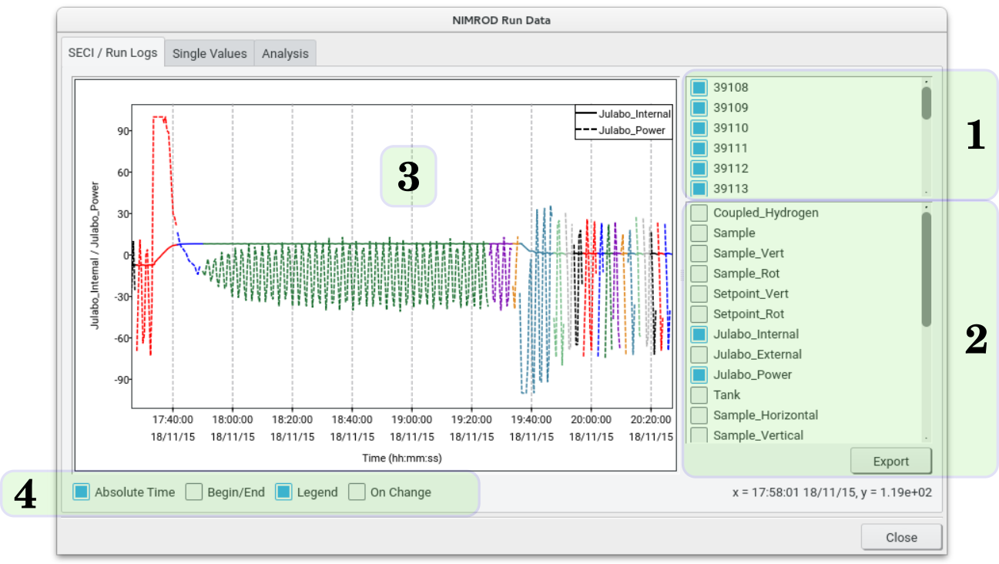

The Run Data Window (accessed by double-clicking an entry in the main table, or by using options on the View menu) allows interrogation of the data contained within the `log` and `nxs` files associated with each experimental run. This data essentially encompasses all block values defined in the current SECI session, written at frequencies defined on a per-value basis, and can include beamline information such as jaw settings, ISIS status variables such as the current being delivered to the target stations, and any values being read out from sample environment equipment currently installed. **JournalViewer** allows all this information to be quickly and easily plotted as a function of time, and across multiple runs.

{.imgfull}

## SECI / Run Logs**

For a set of plotted data files, the **SECI / Run Logs** tab gives a list of those run numbers at the top-right (1), and a list of the available SECI block values across all those run numbers at the bottom-right of the window (2). By default, all runs are selected when the window is shown - properties of interest may then be plotted on the graph area by selecting them from the lower list. The selected run numbers / run data may be exported to a text file with the **Export** button at the lower-right of the window.

The main graphing area (3) on the left of the **SECI / Run Logs** tab displays the currently-selected data - datasets from individual runs are drawn in different colours, while run properties are differentiated by different line styles (solid, dashed, etc.). Several options (4) affect how the data is plotted:

| Option | Description |
|--------|-------------|
| **Absolute Time** | If ticked (the default) then the x-axis on the graph will use date/time values as markers, typically giving a continuous plot of the run property as a function of time. If unticked then the data for each run will be plotted against hours, minutes and seconds relative to the starting time of each data collection period (i.e. when the BEGIN command was issued within SECI). As such, negative time indicates SECI log values that were collected before the BEGIN command. |
| **Begin/End** | Toggles display of vertical blocks defining the exact start and end times of the run (i.e. corresponding to when the BEGIN and END commands were issued to the DAE). |
| **Legend** | Toggles display of a legend listing each run property being displayed. |
| **On Change** | Controls how lines between datapoints are drawn.  If not enabled, the data is assumed to represent a continuously-changing variable, and draws lines directly between each consecutive point. However, this is not necessarily the case, and SECI allows datapoints to be logged only if the value has changed beyond a specified threshold limit. Enabling the On Change option will draw strict horizontal and vertical lines between points, so as not to 'embellish' the data. |

The main graph is fully controllable with the mouse, and several keyboard shortcuts also exist. The current position of the mouse in data-space coordinates is always displayed at the bottom-right of the tab.

| Action | Description |
|--------|-------------|
| Left-Click | Shifts the viewport of the graph, without changing the scale of the x and y axes. The direction and magnitude of the shift is defined by the vector between the centrepoint of the graph and the current mouse position. |
| Left-Click-Drag | Allows a portion of the graph to be zoomed in to, as defined by the rectangle drawn by the mouse. |
| Middle-Click-Drag | Slides the visible area of the graph with the mouse. |
| Right-Click | Raises a context menu with several options. **Show All** resets the x and y axes to display all of the data for the currently-selected runs / properties. **Copy to Clipboard** places an image of the current graph (at its current size) on the clipboard for quick pasting elsewhere. |

The available keyboard shortcuts are as follows:

| Key | Description |
|-----|-------------|
| A | Expand the limits of the graph on X and Y to encompass all of the data currently being displayed. |
| K | Toggle between logarithmic and normal x axis |
| L | Toggle between logarithmic and normal y axis |

## Single Values

The **Single Values** tab lists various parameters such as SECI configuration name, wiring table file etc. (note that this information is extracted only from the `nxs` file, so this table will be empty if plotting from the `log` file).

## Analysis

The **Analysis** tab lists each run property in turn, and gives the total number of available points along with basic analysis of the values. Two sets of minimum/average/maximum values are calculated by **JournalViewer** - those from points that occur over the actual run time, and those from all available values, regardless of their acquisition time relative to the BEGIN/END of the run. Since the frequency of value logging varies quite significantly between sample environment values and instruments, average values are calculated by weighting the property values by the number of seconds elapsed between it and the next logged point.

