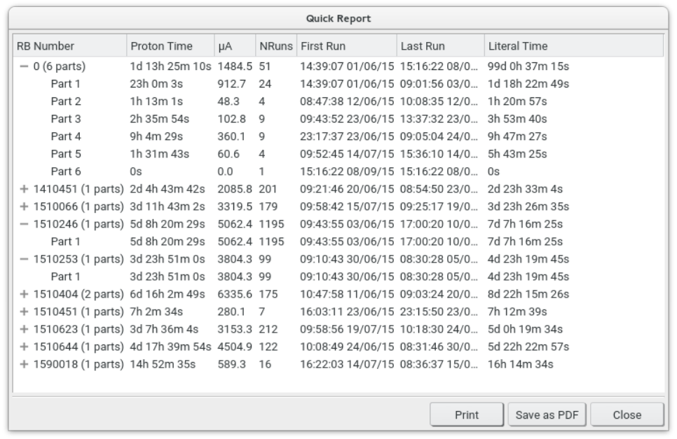

Selecting **Tools&;8594;Create Quick Report** opens up a window displaying various information collected for each distinct RB number present (used) in the currently loaded journal(s). For each RB number, the total proton time used, total proton current collected, number of runs made etc. is given.

Since there is no guarantee that all runs for a given experiment will be performed back-to-back, **JournalViewer** tries to take account of this by partitioning the runs into 'parts', reflecting the contiguous chunks of data accumulation under a single RB number performed on the instrument. Thus, the total proton time is a reasonable reflection of accelerator time 'spent' on an experiment, while the literal time gives a straight measure of time elapsed between the start of the first run and end of the last run.

{.imgfull}

