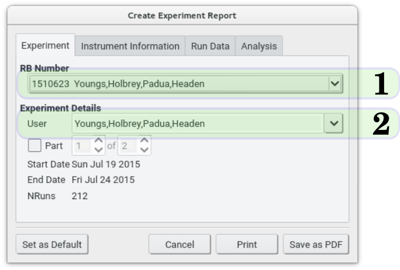
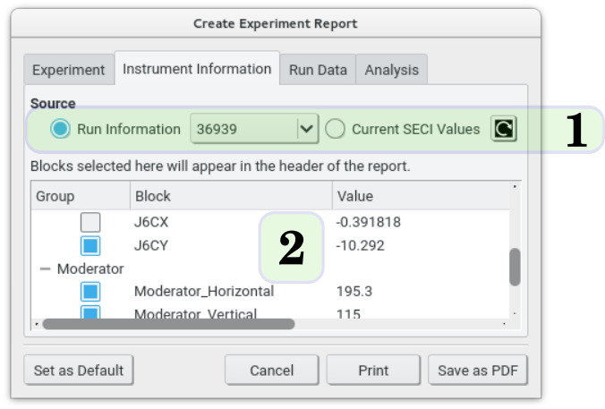
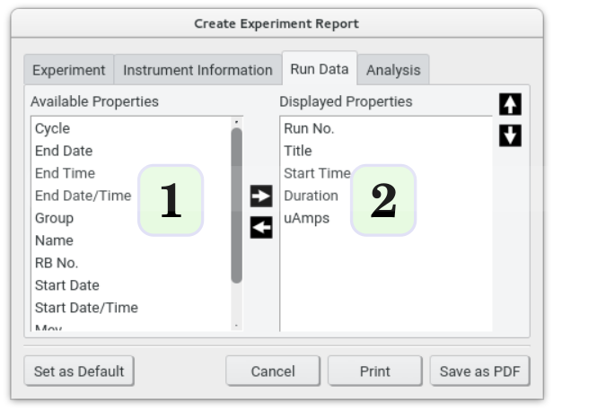
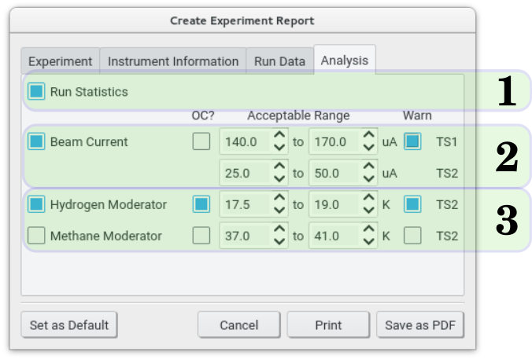

A more comprehensive report for a single RB number can be generated in a so-called experiment report, accessed through Tools?Create Experiment Report.  The experiment report window then offers several options guiding the content of the resulting report, the main body of which contains the details of every run collected during that experiment.

## 1. Experiment

{.imgfull}

A single RB number must first be selected on the **Experiment** tab and which will be the target of the report. The list of available RB numbers (1) is taken from the current journal(s). The User string is taken from the first run number from the experiment, but may be edited here (e.g. to put full names of experimenters in etc.) (2). Optionally, the experiment report may be 'tagged' to state that this is one part of a multi-part experiment using the Part controls. Note that 'parts' in this context are distinct from those determined in a quick report.

## 2. Instrument Information

{.imgfull}

It is often useful to store beamline-related information along with the experiment, and the **Instrument Information** tab allows single block values taken from a specified run in the experiment or, optionally, the Current SECI Values, (1) to be added to the header of the report. Any item checked in the list (2) will appear in the header of the final report.

## 3. Run Data

{.imgfull}

In much the same way as the visible columns of the main table may be changed, so the properties for each run to be output may be modified on the **Run Data** tab. The left list represents the available properties, while the right list shows those that are currently selected for output in the final report.  Selecting one and clicking the appropriate left / right arrow will move the properties between the two lists, and the final ordering of the displayed properties can be changed with the up / down arrows.

## 4. Analysis

{.imgfull}

Finally, the report may be enhanced with time analysis of the runs taken in the experiment (1) and graphs of the primary ISIS parameters (beam current and moderator temperatures) over the course of the experiment (2,3). These graphs, if selected, will appear at the start of the report. Optionally, warning marks may be printed on the graphs where the parameters go outside of a specified range (designed to be related to the vetoes present on the instrument used to collect the data) by selecting the relevant Warn checkboxes. As with the Run Data window (Chapter 5) these parameters are plotted as if they were continuously changing variables, but may be plotted in the alternative discrete style by selecting the OC? ('on change') checkboxes.

