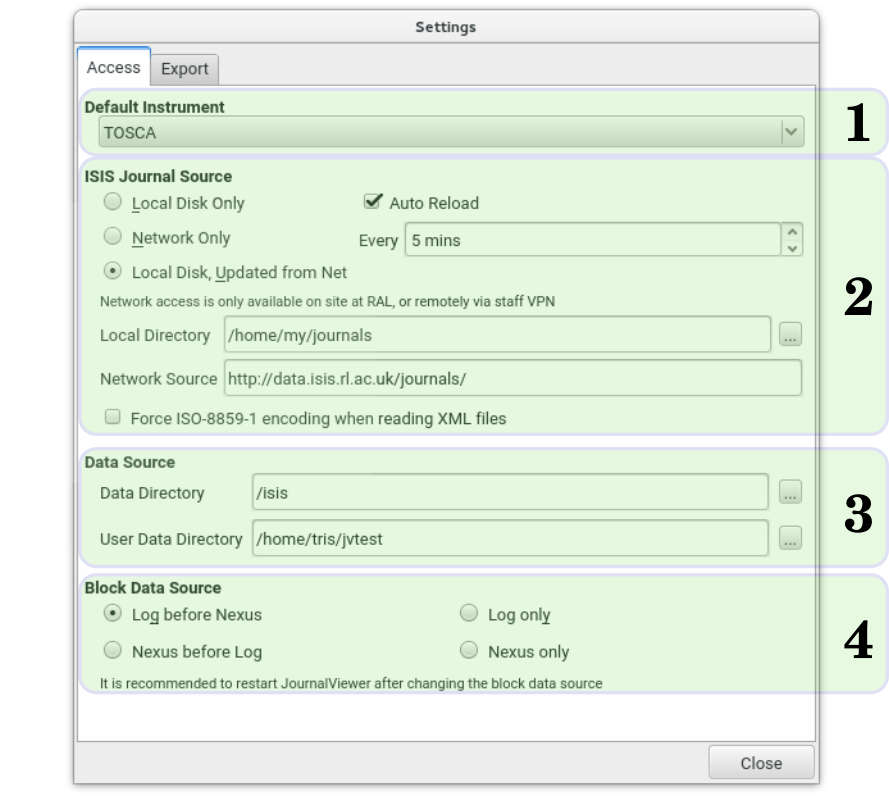

The **Access** tab of the **Settings** window specifies the network and disk locations of the target journal files, and also defines how data is accessed.

{.imgfull}

### Default Instrument (1)

A specific instrument whose journal files should be loaded immediately on startup (or LOCAL for the local user data, or <None> to use the first instrument in the list).

### ISIS Journal Source (2)

The location from which to acquire journal data for all instruments. **Local Disk Only** means only previously-saved local journals will be available, while **Network Only** reloads journal files from the **Network Source** every time. **Local Disk, Updated from Net** will check for local copies of journals first, reloading out-of-date journals from the network, and storing updated journals on disk as it proceeds.

The **Local Directory** should be set to a location on the user's hard disk, and will be used to store updated journals retrieved from the network.

The **Network Source** should be set to the location of the journal xml files accessible by HTTP (currently http://data.isis.rl.ac.uk/journals/).

Automatic reloading of the currently-displayed journal file can be enabled with the **Auto Reload** feature, with a corresponding poll interval time (in minutes).

If **Force ISO Encoding** is ticked, then the encoding of the journal xml files (usually UTF-8) is ignored, and ISO-8859-1 is assumed instead. This can be enabled if problems with special characters (i.e. accents on user names) present in the journal prevent the data from being loaded correctly.

### Data Source (3)

The two locations here represent the areas to search when attempting to load *.log or *.nxs files (when plotting data etc.). The **Data Directory** should point to the network share location that holds all instrument run data. Note that this setting is heavily operating system-dependent.

For Windows machines on the STFC network it should be sufficient to use \\isis\inst$ as the Data Directory, provided the current user is authenticated with a suitable federal ID. For OSX machines it is necessary to first mount the correct Windows share:

1. From the Finder tool select **Go&#8594;Connect to Server**
2. Enter `smb://isis/inst$` as the **Location**
3. Click **Connect** and you will be prompted for your federal ID and password
4. Once successfully authorised the data should be accessible through `\\Volumes\\isis$`
5. In **JournalViewer**'s settings, enter `\\Volumes\\isis$` as the **Data Directory**

For Linux systems the process is similar, but the variety present within the available distributions makes a comprehensive guide impossible. From the command line the procedure is as follows on an OpenSuSE 13.1 system:

1. As root, create a directory mount point for the Windows share, e.g. `/isisdata`
2. As root, mount the Windows share with the following command, replacing `abc12345` with your federal ID:

```
bob@pc:~> mount -t cifs //isisdata/inst$ -o "user=abc12345,sec=ntlm" /isisdata
```

3. Enter the password associated to your federal ID
4. In **JournalViewer**'s settings, enter `/isisdata` as the **Data Directory**

The **User Data Directory** may point to a disk-based location where raw, log, and nxs files exist, and which **JournalViewer** treats as data for the LOCAL instrument. See [viewing user data](/jv/docs/userdata) for more information.

### Block Data Source (4)

When reading block (sample environment) data for a given run there are two possible sources of data: the log file, or the nxs file. These options allow control of which source(s) to use when loading data for plotting (by double-clicking on the main table or using the **F1** shortcut).

