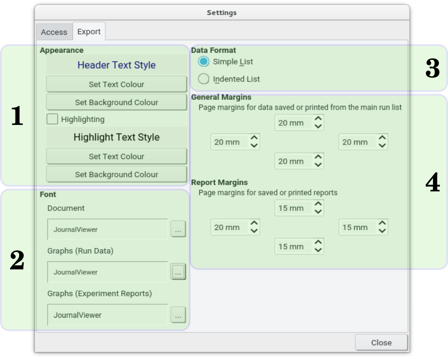

The controls on the **Export** tab allow tweaking of the style in which exported pdf documents are displayed, including setting margins. The settings do not affect text document export, save for the ability to set the margins for such documents separately.

{.imgfull}

### Appearance (1)

Colours used for header text and background in exported tables in pdf documents. If **Highlighting** is enabled, alternate rows will use the specified highlight colours. Normal, non-highlighted rows are always written using black text on a white background.

### Font (2)

Specified the particular font to use for text in exported documents, and for graphs in the [**Run Data** window](/jv/docs/plotting) and in generated [experimental reports](/jv/docs/report/experiment).

### Data Format (3)

When exporting a list of runs from the main table, selects between a 'simple' list of run data, or an 'indented' form. A simple list puts all data items for a given run on one line, while in the latter the run number and title are written on a 'header' line of their own, followed by additional data on the next (indented) line.  Additionally, if grouping of runs is enabled, runs with similar titles will appear under the same heading.

### Margins (4)

Sets the margins, in centimetres, to use in both plain exported data and for [experimental reports](/jv/docs/reports/experiment).

